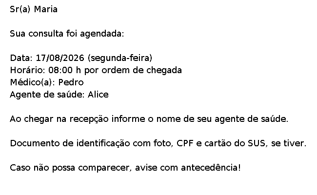

# Gerador de Fichas

Este é um projeto criado para resolver um problema que minha mãe, uma agente comunitária de saúde, enfrentava no dia a dia: a criação de fichas para o agendamento de consultas.

## Acesse o projeto

Você pode acessar o programa através do GitHub Pages:

https://outofbluee.github.io/gerador-de-fichas-java-frontend/

## Como funciona

O programa recebe algumas informações básicas sobre a consulta:

- Nome do paciente;
- Data da consulta;
- Horário da consulta;
- Nome do médico;
- Nome do agente de saúde.

Após preencher o formulário e clicar em **Gerar Ficha**, o sistema gera uma imagem PNG contendo as informações da consulta e a exibe na página.

A imagem pode então ser baixada através do botão **Baixar Ficha** e compartilhada com o paciente, por exemplo, através do WhatsApp.

## Exemplo

Abaixo está um exemplo de ficha gerada pelo sistema:

## Motivação

As fichas de agendamento eram inicialmente feitas em papel. Com o tempo, esse processo passou a ser realizado de forma digital, principalmente através de mensagens no WhatsApp.

Apesar de simples, esse processo ainda exigia que as informações da ficha fossem digitadas repetidamente sempre que uma nova consulta precisava ser comunicada.

Além disso, como a ficha era basicamente uma mensagem de texto, seu conteúdo poderia ser facilmente alterado ou copiado, o que tornava o processo menos padronizado.

Foi pensando nisso que surgiu a ideia:

> E se fosse possível informar apenas os dados básicos de uma consulta e gerar automaticamente uma ficha pronta para ser compartilhada?

A partir dessa ideia nasceu o **Gerador de Fichas**.

O objetivo do projeto é tornar a criação dessas fichas mais rápida, padronizada e prática, reduzindo a necessidade de redigitar as mesmas informações manualmente.

## Tecnologias utilizadas

### Frontend

- HTML
- CSS
- JavaScript
- Bootstrap

O frontend é responsável pelo formulário, comunicação com a API e exibição da imagem gerada.

### Backend

- Java
- Spring Boot
- Maven
- `BufferedImage` / `Graphics2D`

O backend funciona como uma API REST. Ele recebe os dados da consulta, gera a imagem da ficha e retorna o arquivo PNG para o frontend.

### Infraestrutura

- GitHub Pages — hospedagem do frontend
- Render — hospedagem do backend
- Docker — containerização da aplicação backend

## Status do projeto

O projeto possui uma versão **MVP (Minimum Viable Product)** funcional e está disponível para utilização.

A próxima etapa planejada é explorar uma segunda implementação da geração das fichas utilizando HTML, CSS e JavaScript, reaproveitando o frontend desenvolvido nesta versão. Mas isso fica para os próximos capítulos do projeto...

## Objetivo do projeto

Além de resolver um problema real, este projeto também foi desenvolvido como uma oportunidade de aprendizado e prática de desenvolvimento web, especialmente com Java, Spring Boot, APIs REST, JavaScript, Docker e deploy de aplicações.